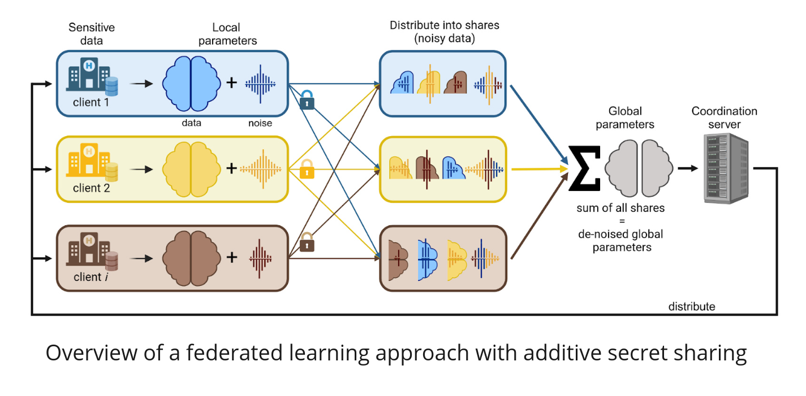
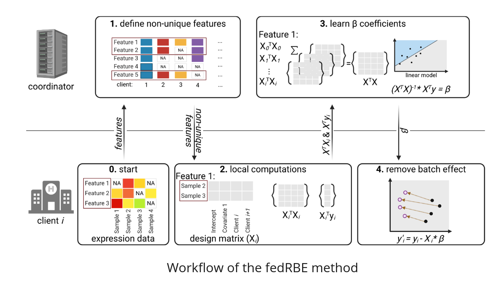

# Federated Limma Remove Batch Effect (fedRBE)

[](https://github.com/Freddsle/fedRBE/blob/main/LICENSE)
[](https://arxiv.org/abs/2412.05894)
[](https://freddsle.github.io/fedRBE/)
[](https://github.com/Freddsle/fedRBE)

---

## Table of Contents
- [Federated Limma Remove Batch Effect (fedRBE)](#federated-limma-remove-batch-effect-fedrbe)
  - [Table of Contents](#table-of-contents)
  - [Features](#features)
  - [Architecture Overview](#architecture-overview)
  - [Installation](#installation)
    - [Prerequisites](#prerequisites)
    - [Clone the Repository](#clone-the-repository)
    - [Get the `fedRBE` App](#get-the-fedrbe-app)
  - [Usage](#usage)
    - [Quick Start](#quick-start)
  - [Reproducing the Paper](#reproducing-the-paper)
    - [Steps to Reproduce](#steps-to-reproduce)
  - [Configuration](#configuration)
    - [Example `config.yml`](#example-configyml)
  - [Examples](#examples)
    - [Single-Machine Simulation](#single-machine-simulation)
  - [Troubleshooting](#troubleshooting)
  - [License](#license)
  - [How to cite](#how-to-cite)
  - [Contact Information](#contact-information)


---

The **Federated Limma Remove Batch Effect (fedRBE)** offers a federated implementation of the limma `removeBatchEffect` algorithm. Implemented within the [FeatureCloud](https://featurecloud.ai/) platform, `fedRBE` enables batch effect correction in a privacy-preserving manner, ensuring that raw data remains decentralized.

This repository serves two main purposes:
1. **fedRBE Implementation**: Located in the `batchcorrection` subfolder, providing the federated batch effect removal tool.
2. **Reproducibility**: Contains code and scripts to reproduce the analyses presented in our [ArXiv preprint](https://arxiv.org/abs/2412.05894).

For usage instructions and how-to guides, refer to the [How To Guide](https://freddsle.github.io/fedRBE/docs/how_to_guide.html).
For more detailed information on the `fedRBE` implementation and configuration, see the [README](https://freddsle.github.io/fedRBE/batchcorrection/).

The App is located at [FeatureCloud](https://featurecloud.ai/app/fedrbe) and can be used directly from the platform.

---

## Features

- **Federated Learning**: Collaborate across multiple clients without sharing raw data, ensuring data privacy.
- **Batch Effect Removal**: Effectively removes non-biological variations using limma’s `removeBatchEffect` in a federated setting.
- **Flexible Input Formats**: Supports various data formats.
- **Secure Computation**: Utilizes Secure Multiparty Computation (SMPC) for privacy-preserving data aggregation.
- **Easy Integration**: Integrates with the FeatureCloud platform for streamlined workflow management.

<p align="center">
   
</p>

---

## Architecture Overview

`fedRBE` operates within the FeatureCloud ecosystem. The workflow involves multiple clients performing batch effect correction locally. One of the clients is also acting as a coordinator, aggregating summary statistics. Data remains with each client, and only summary statistics are shared, ensuring data privacy throughout the process.

<p align="center">
   
</p>

_For a detailed workflow, see the [How To Guide](https://freddsle.github.io/fedRBE/docs/how_to_guide.html#understanding-the-workflow)._

---

## Installation

### Prerequisites

Before installing `fedRBE`, ensure you have the following installed:
1. **Docker**: [Installation Instructions](https://www.docker.com/get-started)
2. **FeatureCloud CLI**:
   ```bash
   pip install featurecloud
   featurecloud controller start
   ```
For Windows users, git must also be installed and added to PATH. We recommend
and tested using [WSL](https://docs.docker.com/desktop/features/wsl/).

### Clone the Repository

```bash
git clone https://github.com/Freddsle/fedRBE.git
cd fedRBE
```

This will clone the repository to your local machine with example files and simulation scripts.

### Get the `fedRBE` App

pull the pre-built image:

```bash
featurecloud app download featurecloud.ai/bcorrect
# Or directly via Docker
docker pull featurecloud.ai/bcorrect:latest
```

_**Note**: 
Alternatively, If you are using a ARM architecture (e.g., Mac M-series), you may need to build the image locally as shown below._

Navigate to the `batchcorrection` directory and build the Docker image:

```bash
cd batchcorrection
docker build . -t featurecloud.ai/bcorrect:latest
```

---

## Usage

### Quick Start

Run simulations locally to understand `fedRBE`'s behavior:

1. **Ensure the full repository including sample data is cloned and the current working directory**:
   ```bash
   git clone https://github.com/Freddsle/fedRBE.git
   cd fedRBE
   ```

2. **Start the FeatureCloud Controller with the correct input folder**:
   ```bash
   featurecloud controller start --data-dir=./evaluation_data/simulated/mild_imbalanced/before/
   ```

3. **Build or Pull the `fedRBE` App** as per the [Installation](#installation) instructions.

4. **Run a Sample Experiment**:
   ```bash
   featurecloud test start --app-image=featurecloud.ai/bcorrect:latest --client-dirs=lab1,lab2,lab3
   ```
   Alternatively, you can start the experiment from the [frontend](https://featurecloud.ai/development/test/new)

   Select 3 clients, add lab1, lab2, lab3 respecitvely for the 3 clients to their path. 
   
   Use `featurecloud.ai/bcorrect:latest` as the app image.

_For a step-by-step detailed instructions on how to start collaboration using multiple machines, refer to the [How To Guide](https://freddsle.github.io/fedRBE/docs/how_to_guide.html)._

---

## Reproducing the Paper

This repository includes all necessary code and data to reproduce the analyses presented in our [ArXiv preprint](https://arxiv.org/abs/2412.05894).

### Steps to Reproduce

1. **Ensure Prerequisites are Met**:
   - Docker installed
   - FeatureCloud CLI installed and running (`featurecloud controller start`)
   - `fedRBE` app built or pulled as per the [Installation](#installation) section
   - Install necessary dependencies.

2. **Run the Federated Batch Effect Removal**:
   ```bash
   python3 ./evaluation_utils/get_federated_corrected_data.py
   ```

3. **Compare with Centralized Correction**:
   ```bash
   python3 ./evaluation_utils/analyse_fedvscentral.py
   ```

_For detailed instructions on reproducing the paper, refer to the [Reproducibility Guide](./reproduce)._

---

## Configuration

`fedRBE` is highly configurable via the `config.yml` file. This file controls data formats, normalization methods, and other essential parameters.

### Example `config.yml`

```yaml
flimmaBatchCorrection:
  data_filename: "expression_data_client1.csv"
  expression_file_flag: False
  index_col: "GeneIDs"
  covariates: ["Pyr"]
  separator: ","
  design_separator: ","
  normalizationMethod: "log2(x+1)"
  smpc: True
  min_samples: 2
  position: 1
  reference_batch: ""
```

_For a comprehensive list of configuration options, refer to the [Configuration Section](https://freddsle.github.io/fedRBE/batchcorrection/#configuration-configyml) in the batchcorrection README._

---

## Examples

### Single-Machine Simulation

To simulate a federated workflow on a single machine using provided sample data:

1. **Run the Sample Experiment**:
   ```bash
   python3 ./evaluation_utils/run_sample_experiment.py
   ```

2. **Review Results**:
   - Batch-corrected data: `only_batch_corrected_data.csv`
   - Report: `report.txt`

---


## Troubleshooting

Encountering issues? Here are some common problems and their solutions:

- **Missing Files**: Ensure `config.yml` and data files are in the correct directory.
- **Incorrect Format**: Verify `expression_file_flag` and `index_col` settings in `config.yml`.
- **No Output Produced**: Check `report.txt` and logs for error messages.

_For detailed troubleshooting tips, refer to the [How To Guide](https://freddsle.github.io/fedRBE/docs/how_to_guide.html#troubleshooting-tips)._


## License

This project is licensed under the [Apache License 2.0](LICENSE).

---

## How to cite

If you use `fedRBE` in your research, please cite our [ArXiv preprint](https://arxiv.org/abs/2412.05894):

 > Burankova, Y., Klemm, J., Lohmann, J.J., Taheri, A., Probul, N., Baumbach, J. and Zolotareva, O., 2024. FedRBE--a decentralized privacy-preserving federated batch effect correction tool for omics data based on limma. arXiv preprint arXiv:2412.05894.

   ```bibtex
   @misc{burankova2024fedrbedecentralizedprivacypreserving,
         title={FedRBE -- a decentralized privacy-preserving federated batch effect correction tool for omics data based on limma}, 
         author={Yuliya Burankova and Julian Klemm and Jens J. G. Lohmann and Ahmad Taheri and Niklas Probul and Jan Baumbach and Olga Zolotareva},
         year={2024},
         eprint={2412.05894},
         archivePrefix={arXiv},
         primaryClass={q-bio.QM},
         url={https://arxiv.org/abs/2412.05894}, 
   }
   ```


---

## Contact Information

For questions, issues, or support, please open an issue on the [GitHub repository](https://github.com/Freddsle/fedRBE).

