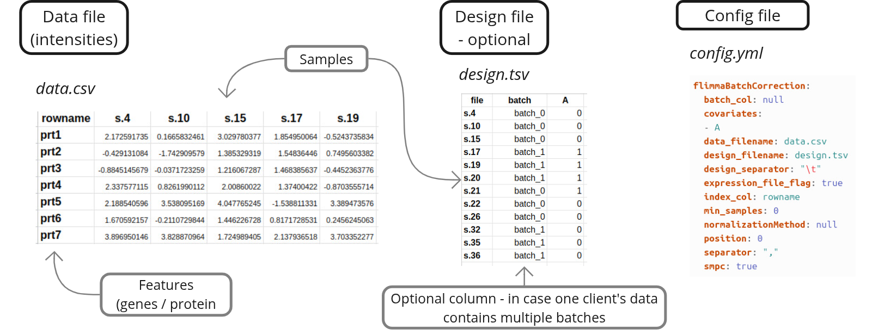

<table>
  <tr>
    <td><a href="https://freddsle.github.io/fedRBE/docs/how_to_guide.html"></a></td>
    <td><a href="https://freddsle.github.io/fedRBE/"></a></td>
    <td><a href="https://github.com/Freddsle/fedRBE/"></a></td>
    <td><a href="https://featurecloud.ai/app/fedrbe"></a></td>
  </tr>
</table>


# Federated Limma Remove Batch Effect (fedRBE) <!-- omit in toc -->

[](https://github.com/Freddsle/fedRBE/blob/main/LICENSE)
[](https://arxiv.org/abs/2412.05894)

---

## Table of Contents <!-- omit in toc -->
- [Architecture overview](#architecture-overview)
- [Installation](#installation)
  - [Prerequisites](#prerequisites)
  - [Clone the repository](#clone-the-repository)
- [Usage](#usage)
  - [Glossary \& further resources](#glossary--further-resources)
  - [Input and Output](#input-and-output)
  - [Configuration](#configuration)
  - [Quick start](#quick-start)
- [Reproducing the paper](#reproducing-the-paper)
- [Single-machine simulation](#single-machine-simulation)
- [Troubleshooting](#troubleshooting)
- [License](#license)
- [How to cite](#how-to-cite)
- [Contact information](#contact-information)


---

## Architecture overview

The **Federated Limma Remove Batch Effect (fedRBE)** is a federated implementation of the limma `removeBatchEffect` algorithm, developed within the [FeatureCloud](https://featurecloud.ai/) platform. It enables privacy-preserving batch effect correction by keeping raw data decentralized and utilizing Secure Multiparty Computation (SMPC) for secure data aggregation.

fedRBE allows multiple participants to collaboratively remove batch effects from their data without sharing raw data, ensuring privacy. It effectively eliminates non-biological variations arising from different sources such as labs, time points, or technologies, using limma’s `removeBatchEffect`. The tool supports various data formats and seamlessly integrates with the FeatureCloud platform for streamlined workflow management.

<p align="center">
   
   <br>
   <em>fedRBE app states. <a href="https://arxiv.org/abs/2412.05894" target="_blank">Source: ArXiv 2412.05894</a></em>
</p>


The repository serves two main purposes:
- **fedRBE Implementation**: Located in the `batchcorrection` subfolder, providing the federated batch effect removal tool.
- **Reproducibility**: Contains code and scripts to reproduce the analyses presented in our [ArXiv preprint](https://arxiv.org/abs/2412.05894).


<p align="center">
   
   <br>
   <em>fedRBE architecture. <a href="https://arxiv.org/abs/2412.05894" target="_blank">Source: ArXiv 2412.05894</a></em>
</p>


You can access and use the `fedRBE` app directly on [FeatureCloud](https://featurecloud.ai/app/fedrbe). 

For detailed usage instructions and implementation information, refer to the [How To Guide](https://freddsle.github.io/fedRBE/docs/how_to_guide.html) and the [README](https://freddsle.github.io/fedRBE/batchcorrection/).

For a comprehensive overview of the workflow, please consult the [How To Guide](https://freddsle.github.io/fedRBE/docs/how_to_guide.html#understanding-the-workflow).

---
## Installation

### Prerequisites

Before installing `fedRBE`, ensure you have the following installed:
1. **Docker**: [Installation Instructions](https://www.docker.com/get-started)
2. **FeatureCloud CLI**.
   For Windows users, git must also be installed and added to PATH. We recommend
   and tested using [WSL](https://docs.docker.com/desktop/features/wsl/).
3. **App Image** (either build locally or pull).

For installation and setup details, see the [main README](https://freddsle.github.io/fedRBE/batchcorrection/##prerequisites-and-setup).

### Clone the repository

If you want to run the simulations locally, clone the repository (or check [Quick Start](#quick-start) below):

```bash
git clone https://github.com/Freddsle/fedRBE.git
cd fedRBE
```

This will clone the repository to your local machine with example files and simulation scripts.

---

## Usage

### Glossary & further resources

- **FeatureCloud**: A platform enabling federated analyses. [FeatureCloud docs](https://featurecloud.ai/)
- **limma**: A popular R package for differential expression analysis. `RemoveBatchEffect` is a function from limma.

For more advanced configurations and detailed explanations, see the 
[main README](https://freddsle.github.io/fedRBE/batchcorrection/#config) and the [ArXiv preprint](https://doi.org/10.48550/arXiv.2412.05894).

If you encounter difficulties, please:
- Check the logs for error messages.
- Revisit the [main README](https://freddsle.github.io/fedRBE/batchcorrection/).
- Reach out to the support by creating an issue on the [GitHub repository](https://github.com/Freddsle/fedRBE)

---


### Input and Output

For files preparation, format, config file, and output details, refer to the [How To Guide](https://freddsle.github.io/fedRBE/docs/how_to_guide.html#file-preparation).

In summary, you need two main inputs and one optional file:

<p align="center">
   
   <br>
   <em>Input files required for fedRBE.</em>
</p>

Output files include:
- **Corrected Data**: The batch-corrected data in the same format as the input.
- **Report**: A summary of the correction process and results.


---


### Configuration

`fedRBE` is highly configurable via the `config.yml` file. This file controls data formats, normalization methods, and other essential parameters.

**Example `config.yml`**:

   ```yaml
   flimmaBatchCorrection:
   data_filename: "expression_data_client1.csv"
   expression_file_flag: False
   index_col: "GeneIDs"
   covariates: ["Pyr"]
   separator: ","
   design_separator: ","
   normalizationMethod: "log2(x+1)"
   smpc: True
   min_samples: 2
   position: 1
   reference_batch: ""
   ```

_For a comprehensive list of configuration options, refer to the [Configuration Section](https://freddsle.github.io/fedRBE/batchcorrection/#configuration-configyml) in the batchcorrection README._

---

### Quick start

1. For a step-by-step detailed instructions on how to start collaboration using multiple machines, refer to the [How To Guide](https://freddsle.github.io/fedRBE/docs/how_to_guide.html)
2. For a step-by-step instructions on how to simulate collaboration via test environment, refer to the [Local Test Guide](https://freddsle.github.io/fedRBE/docs/local_test.html)

---

## Reproducing the paper

This repository includes all necessary code and data to reproduce the analyses presented in our [ArXiv preprint](https://arxiv.org/abs/2412.05894).

Steps to Reproduce:

1. **Ensure Prerequisites are Met**:
   - Docker installed
   - FeatureCloud CLI installed and running (`featurecloud controller start`)
   - `fedRBE` app built or pulled as per the [Installation](#installation) section
   - Install necessary dependencies.

2. **Run the Federated Batch Effect Removal**:
   ```bash
   python3 ./evaluation_utils/get_federated_corrected_data.py
   ```

3. **Compare with Centralized Correction**:
   ```bash
   python3 ./evaluation_utils/analyse_fedvscentral.py
   ```

_For detailed instructions on reproducing the paper, refer to the [Reproducibility Guide](https://freddsle.github.io/fedRBE/docs/reproduce.html)._


---

## Single-machine simulation

To simulate a federated workflow on a single machine using provided sample data:

1. Check the [Prerequisites](#prerequisites) and [Clone the Repository](#clone-the-repository).
2. **Run the Sample Experiment** according to the [Local Test Guide](https://freddsle.github.io/fedRBE/docs/local_test.html).

---

## Troubleshooting

Encountering issues? Here are some common problems and their solutions:

- **Missing Files**: Ensure `config.yml` and data files are in the correct directory.
- **Incorrect Format**: Verify `expression_file_flag` and `index_col` settings in `config.yml`.
- **No Output Produced**: Check `report.txt` and logs for error messages.

_For detailed troubleshooting tips, refer to the [How To Guide](https://freddsle.github.io/fedRBE/docs/how_to_guide.html#troubleshooting-tips)._


## License

This project is licensed under the [Apache License 2.0](LICENSE).

---

## How to cite

If you use `fedRBE` in your research, please cite our [ArXiv preprint](https://arxiv.org/abs/2412.05894):

 > Burankova, Y., Klemm, J., Lohmann, J.J., Taheri, A., Probul, N., Baumbach, J. and Zolotareva, O., 2024. FedRBE--a decentralized privacy-preserving federated batch effect correction tool for omics data based on limma. arXiv preprint arXiv:2412.05894.

   ```bibtex
   @misc{burankova2024fedrbedecentralizedprivacypreserving,
         title={FedRBE -- a decentralized privacy-preserving federated batch effect correction tool for omics data based on limma}, 
         author={Yuliya Burankova and Julian Klemm and Jens J. G. Lohmann and Ahmad Taheri and Niklas Probul and Jan Baumbach and Olga Zolotareva},
         year={2024},
         eprint={2412.05894},
         archivePrefix={arXiv},
         primaryClass={q-bio.QM},
         url={https://arxiv.org/abs/2412.05894}, 
   }
   ```

---

## Contact information

For questions, issues, or support, please open an issue on the [GitHub repository](https://github.com/Freddsle/fedRBE).

