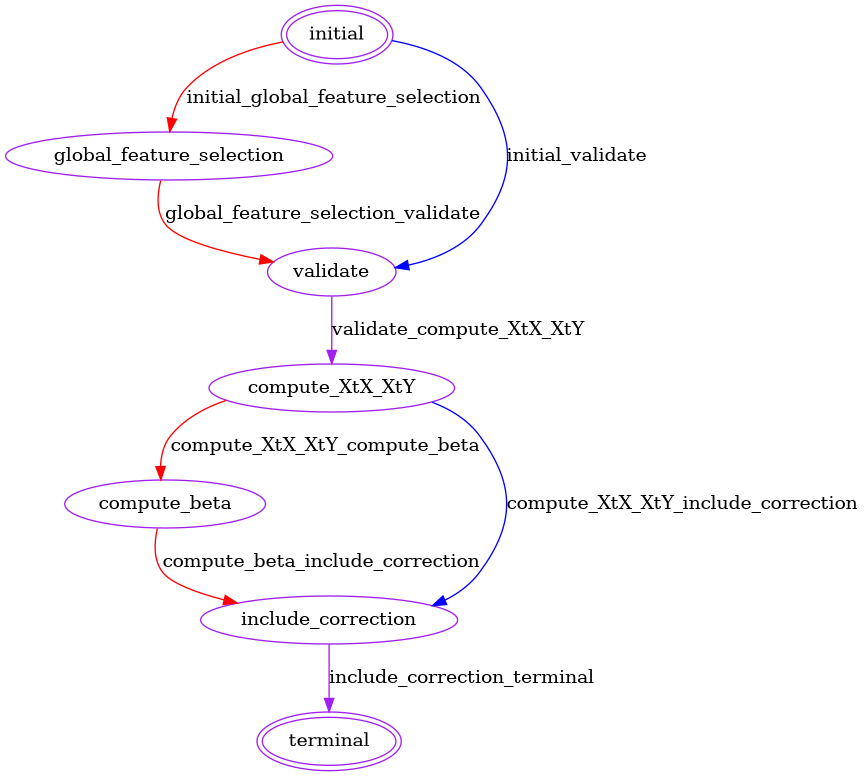

# Federated Limma Remove Batch Effect (fedRBE) - FeatureCloud

**A federated implementation of the limma `removeBatchEffect` method.** 
Each client is assumed to represent one batch (no multiple batches per client). Supports normalization, various input formats, and secure computation.

- **Open Source & Free**: [GitHub Repository](https://github.com/Freddsle/fedRBE/tree/main/batchcorrection)  
- **Federated Privacy-preserving tool**: Based on [FeatureCloud](https://featurecloud.ai/app/fedrbe) platform  
- **Preprint**: [ArXiv](https://doi.org/10.48550/arXiv.2412.05894)

---

## Table of Contents
- [Federated Limma Remove Batch Effect (fedRBE) - FeatureCloud](#federated-limma-remove-batch-effect-fedrbe---featurecloud)
  - [Table of Contents](#table-of-contents)
  - [Overview](#overview)
  - [Prerequisites](#prerequisites)
  - [Usage](#usage)
    - [Simulating a Federated Workflow Locally](#simulating-a-federated-workflow-locally)
    - [Running a True Federated Workflow](#running-a-true-federated-workflow)
  - [Input Requirements](#input-requirements)
  - [Outputs](#outputs)
  - [Configuration (config.yml)](#configuration-configyml)
  - [FeatureCloud App states](#featurecloud-app-states)
  - [Additional Resources](#additional-resources)

---

## Overview
`fedRBE` applies limma’s batch effect removal in a **federated** setting — data remains with the client, and only summary information is shared. Each client hosts one batch. Multiple input formats and normalization methods are supported. For advanced parameters, see the [Configuration](#configuration-configyml) section.

---

## Prerequisites
Before using `fedRBE`, ensure:
1. **Docker** is installed ([FeatureCloud prerequisites](https://featurecloud.ai/developers)).
2. **FeatureCloud CLI**:
   ```bash
   pip install featurecloud
   featurecloud controller start
   ```
3. **App Image**:  
   - For linux/amd64:
     ```bash
     featurecloud app download featurecloud.ai/bcorrect
     ```
     or
     ```bash
     docker pull featurecloud.ai/bcorrect:latest
     ```
   - For non-linux/ARM (e.g., Mac M-series):
     ```bash
     docker build . -t featurecloud.ai/bcorrect:latest
     ```

The app image which is provided in the docker registry of featurecloud built on the linux/amd64 platform. Especially if you're using a Macbook with any of the M-series chips or any other device not compatible with linux/amd64, please build the image locally.

---

## Usage

### Simulating a Federated Workflow Locally
To test how `fedRBE` behaves with multiple datasets on one machine:

```bash
git clone git@github.com:Freddsle/fedRBE.git
python3 ./evaluation_utils/run_sample_experiment.py
```
  
This runs experiments bundled with the app, illustrating how `fedRBE` works.
The given repository contains the app but furthermore includes all the experiments done with the app.

### Running a True Federated Workflow
For an actual multi-party setting:
1. **Create a Project** in [FeatureCloud](https://featurecloud.ai/projects) and invite at least 3 clients.
2. **Clients Join with Tokens** provided by the coordinator.
3. **Each Client** uploads their data and `config.yml` to their local FeatureCloud instance.
4. **Start the Project**: `fedRBE` runs securely, never sharing raw data.

See [HOW TO GUIDE](../docs/how_to_guide.md) for guidance on creating and joining projects.

---

## Input Requirements
- **Data File**: CSV or TSV with either:
  - Samples x Features, or
  - Features x Samples
- **`config.yml`**: Configuration file controlling formats, normalization, and additional parameters.
- **Optional Design Matrix**: CSV/TSV with covariates (samples x covariates).

For details, see the [Configuration](#configuration-configyml) section.

---

## Outputs
Each client after completion receives:
- **`only_batch_corrected_data.csv`**: Batch-corrected features.
- **`report.txt`**: Includes:
  - Excluded features (and why)
  - Calculated beta values
  - Internally used design matrix

**Note**: Output files use the same `separator` defined in `config.yml`.

---

## Configuration (config.yml)
Upload a `config.yml` alongside your data. Adjust parameters as needed:

```yaml
flimmaBatchCorrection:
  data_filename: "lab_A_protein_groups_matrix.tsv"
    # Main data file: either features x samples or samples x features.

  design_filename: "lab_A_design.tsv"
    # Optional design matrix: samples x covariates.
    # Must have first column as sample indices.
    # it is read in the following way:
    # pd.read_csv(design_file_path, sep=seperator, index_col=0)
    # should therefore be in the format samples x covariates
    # with the first column being the sample indices

  expression_file_flag: True
    # True: data_file = features (rows) x samples (columns)
    # False: data_file = samples (rows) x features (columns)
    # format: boolean

  index_col: "sample"
    # If expression_file_flag True: index_col is the feature column name.
    # If expression_file_flag False: index_col is the sample column name.
    # If not given, defaults apply - the index is taken from the 0th column for
    # expression files and generated automatically for samples x features datafiles
    # format: str or int, int is interpreted as the column index (starting from 0)

  covariates: ["Pyr"]
    # Covariates included in the linear model.
    # If no design file, covariates must be present as features in the data file.

  separator: "\t"
    # Separator for main data file.

  design_separator: "\t"
    # Separator for design file.

  normalizationMethod: "log2(x+1)"
    # Normalization: "log2(x+1)" or None.
    # If None, no normalization is applied.
    # More options will be available in future versions.

  smpc: True
    # Enable secure multiparty computation for privacy-preserving aggregation.
    # For more information see https://featurecloud.ai/assets/developer_documentation/privacy_preserving_techniques.html#smpc-secure-multiparty-computation

  min_samples: 5      # format: int
    # Minimum samples per feature required. Adjusted for privacy if needed.
    # If for a feature less than min_samples samples are present,
    # the client will not send any information about that feature
    # Please note that the actual used min_samples might be different
    # as for privacy reasons min_samples = max(min_samples, len(design.columns)+1)
    # This is to ensure that a sent Xty matrix always has more samples
    # than features so that neither X not y can be reconstructed from the Xty matrix.

  position: 1      # format: int
    # Defines client order. The last client in order is the reference batch.
    # Example:
    #  C1(position=0), C2(position=2), C3(position=1) -> Order: C1, C3, C2 (C2 is reference).
    # If empty/None, the order is random, making the batch correction run non deterministic

  reference_batch: ""
    # Explicitly set a reference batch (string) or leave empty.
    # Conflicts in ordering/reference will halt execution.
```

---

## FeatureCloud App states

The app has the following states:

<p align="center">
   
</p>

---
## Additional Resources
- **FeatureCloud Docs**: [featurecloud.ai](https://featurecloud.ai/)
- **SMPC & Privacy Docs**: [Privacy-preserving techniques](https://featurecloud.ai/assets/developer_documentation/privacy_preserving_techniques.html#smpc-secure-multiparty-computation)
- **GitHub Repo**: [removeBatch](https://github.com/Freddsle/fedRBE)
