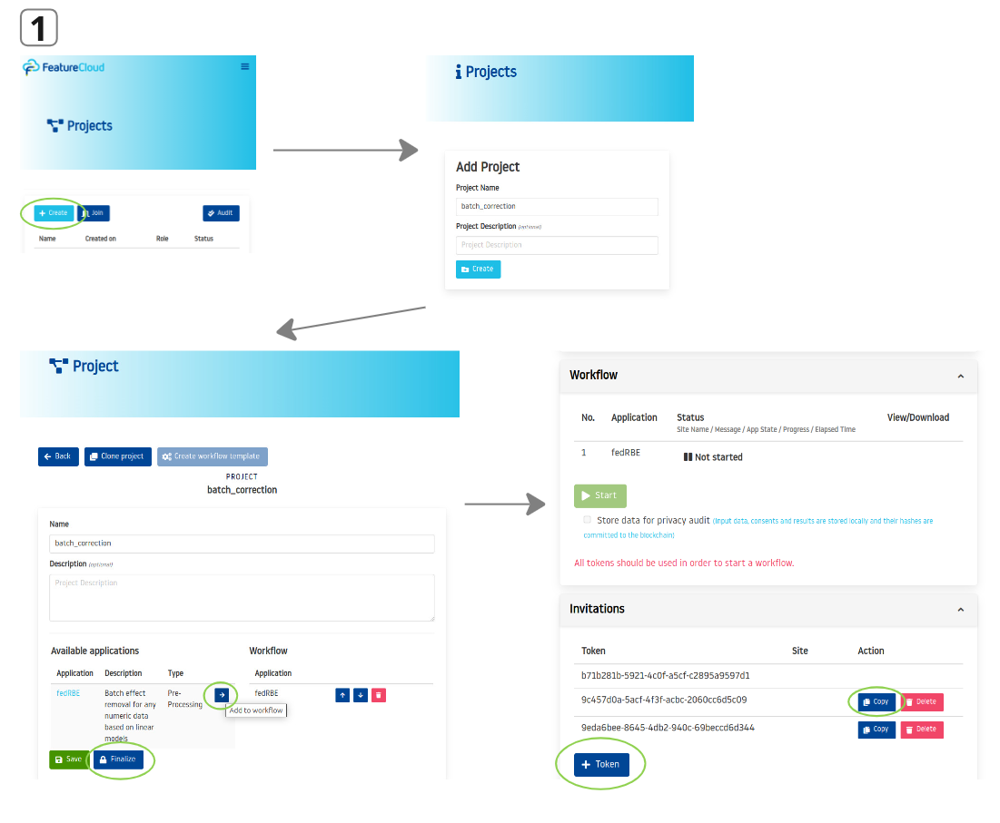
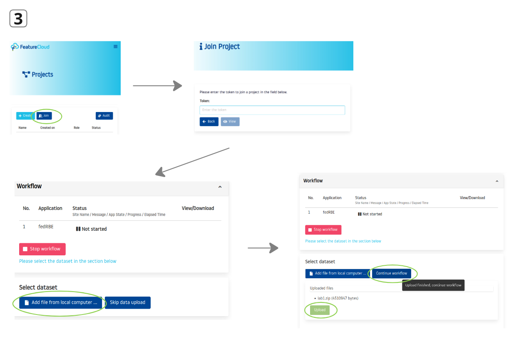

<table>
  <tr>
    <td><a href="https://freddsle.github.io/fedRBE/"></a></td>
    <td><a href="https://github.com/Freddsle/fedRBE/"></a></td>
    <td><a href="https://featurecloud.ai/app/fedrbe"></a></td>
  </tr>
</table>

# Getting started with federated limma remove batch effect (fedRBE) <!-- omit in toc -->

This guide is designed for beginners who want a quick and easy way to start using `fedRBE` and test its functionality. 
For more technical details and advanced usage and specific implementation details, please refer to the [main README file](https://freddsle.github.io/fedRBE/batchcorrection/).

`fedRBE` allows you to remove batch effects from data in a federated manner, ensuring data privacy.

For a more formal description and details, see the fedRBE's preprint on [ArXiv](https://doi.org/10.48550/arXiv.2412.05894).


## List of contents <!-- omit in toc -->

- [Minimal requirements and setup](#minimal-requirements-and-setup)
- [Understanding the workflow](#understanding-the-workflow)
- [File preparation](#file-preparation)
- [Step-by-step scenario](#step-by-step-scenario)
- [Results and output:](#results-and-output)
- [Single-machine simulations using the provided sample data](#single-machine-simulations-using-the-provided-sample-data)
- [Troubleshooting tips](#troubleshooting-tips)
  - [Choosing the correct data orientation](#choosing-the-correct-data-orientation)
  - [Incorporating covariates](#incorporating-covariates)
  - [Selecting a reference batch](#selecting-a-reference-batch)


## Minimal requirements and setup

**Prerequisites** (see [README](https://freddsle.github.io/fedRBE/batchcorrection/#prerequisites) for details):
1. **Docker** installed (check [Docker website](https://www.docker.com/) for installation instructions).
2. **FeatureCloud CLI** installed and running.
3. **App Image** (either build locally or pull).

For installation and setup details, see the [main README](https://freddsle.github.io/fedRBE/batchcorrection/##prerequisites-and-setup).

## Understanding the workflow

Below is a simplified workflow of how to use `fedRBE`:
1. **Coordinator creates a FeatureCloud project and distributes tokens** to at least 3 participants.
2. **Each Participant (Client)** prepares their data and a `config.yml` file.
3. **All Clients join the project** using FeatureCloud and run the app locally.
4. **fedRBE aligns and corrects batch effects** without sharing raw data.
5. **Results are produced locally at each client**, ensuring privacy.

## File preparation

You need two main inputs:
1. **Expression Data File** (CSV/TSV)
2. **`config.yml`** for custom settings
3. and **Optional Design File** with covariates (if needed).

<p align="center">
   
</p>

**Minimal Example Directory Structure**:
```text
client_folder/
├─ config.yml
├─ expression_data.csv
├─ design.csv
```

If you want to simulate a federated workflow on a single machine, you can use the provided sample data and test script. In this case, you need to create at least three folders, each with the sample data and a `config.yml` file (for example, `clientA`, `clientB`, `clientC` folders).

**Example `config.yml` snippet**:
```yaml
flimmaBatchCorrection:
  data_filename: "expression_data_client1.csv"
  expression_file_flag: False # True if data is in samples x features format
  index_col: "GeneIDs"  # Column name to use as index
  covariates: ["Pyr"]   # Covariates column name to include in the design matrix
  separator: ","  # Separator used in the data file
  design_separator: "," # Separator used in the design file
  normalizationMethod: "log2(x+1)"  # Normalization method or log transformation
  smpc: True  # Recommended to set to True
  min_samples: 2  # Minimum number of samples to include a feature
  position: 1   # position of the client (first, second, third, etc.)
  reference_batch: ""  # if True, this client is used as the reference batch
```

For more details on the `config.yml` parameters, see the [main README](https://freddsle.github.io/fedRBE/batchcorrection/#config).

## Step-by-step scenario

**Scenario**: Three clients (A, B, and C) collaborate on a federated analysis. Video tutorial: [link](https://featurecloud.ai/researchers).

1. **Coordinator Actions**:  
   - The coordinator logs into the FeatureCloud platform and **creates a new project**.
   - Add the fedRBE app into the workflow and *finalize the project*.
   - The coordinator **creates tokens** and sends them to Clients A, B, and C.

   <p align="center">
   
   </p>
   
2. **Client Setup**:
   - **Client A, B, C**: Place `expression_data_client.csv` and `config.yml` in a local folder.
   - Adjust `config.yml` parameters as needed (e.g., change `data_filename` to match the correct file name).
   - In case of multiple batches in one client, the client should provide a `design.csv` file with batch information and specify this column name in the `config.yml` parameter `batch_col`.
   
3. **Joining the Project**:
   - Each client uses the FeatureCloud to login and join the project using the provided token.
   - After joining, each client uploads their data and config file to the FeatureCloud GUI client as a one .zip file (without any folder structure inside). It will not be sent to the coordinator or other clients, but makes it available for the Docker container with the app.

   <p align="center">
   
   </p>
   
4. **Running fedRBE**:
   - After all clients join, the coordinator starts the project.
   - The app runs locally at each client, securely combining results.
   
## Results and output:

After completion, each client finds:
   - `only_batch_corrected_data.csv`: The batch-corrected expression data.
   - `report.txt`: Details on excluded features, beta values, and the used design matrix.
   - logs: Detailed logs of the process.
   

## Single-machine simulations using the provided sample data

If you’d like to test everything on one machine, you can run the provided sample data and test script. This simulates multiple clients locally, so you can see the federated workflow in action without needing multiple machines.

For instructions, see the [Local Test Simulation](https://freddsle.github.io/fedRBE/docs/local_test.html) guide.


## Troubleshooting tips

- **Missing Files**: If you see "file not found," ensure that `config.yml` and data files are in the same directory.
- **Incorrect Format**: Check if `expression_file_flag` and `index_col` are set correctly based on your data orientation.
- **No Output Produced**: Review `report.txt` and logs. 
- **Errors with Test runs**: Ensure the is no leftover running Docker containers. Restart Docker / System if necessary. 

### Choosing the correct data orientation

Depending on how your data is structured, you must correctly set `expression_file_flag` in your `config.yml`:

- **If your file is features (rows) x samples (columns)**:  
  `expression_file_flag: True` and `index_col: <feature_id_column>`

- **If your file is samples (rows) x features (columns)**:  
  `expression_file_flag: False` and `index_col: <sample_id_column>`


### Incorporating covariates

If you have additional covariates (e.g., age, treatment type) that might influence your data, you can include them either directly in the `design_filename` file or list them in your `config.yml` under `covariates`. If no separate design file is provided, these covariates must exist as features in the main data file.

**Example:**
```yaml
covariates: ["Age", "Treatment"]
```

### Selecting a reference batch

`fedRBE` needs a reference batch to align the other batches against. By default, if no `reference_batch` is set, it uses the last client in the positional order defined by the `position` parameter. If all parameters are unset, it may choose a batch at random, resulting in non-deterministic runs.

**Example:**
```yaml
position: 2
reference_batch: ""
```

